# SQL Server and Containers

---

## Andrew Pruski

### SQL Server DBA & Microsoft Data Platform MVP

@fa[twitter] @dbafromthecold  
@fa[envelope] dbafromthecold@gmail.com  
@fa[wordpress] www.dbafromthecold.com  
@fa[github] github.com/dbafromthecold

---

### Session Aim

To give an overview of the different options available to run SQL Server in containers

---

### Agenda

<b>Part One</b> - Introduction to docker (demos)  
<b>Part Two</b> - Running containers in Azure

---

### Container Definition

Containers wrap a piece of software in a complete filesystem that contains everything needed to run: code, runtime, system tools, system libraries – anything that can be installed on a server. This guarantees that the software will always run the same, regardless of its environment.  

@size[0.8em](https://www.docker.com/what-docker)

---

### Virtual Machines vs Containers

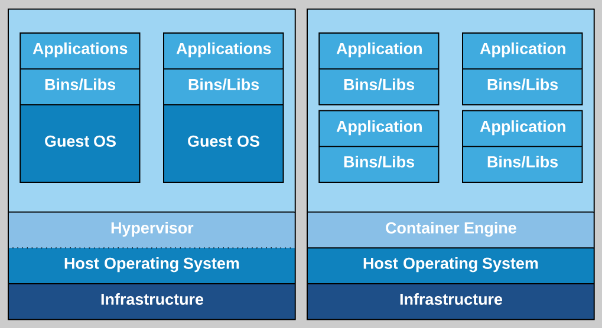

---

## Demos

---

### Azure

Azure Container Registry  
Azure Container Instances  
Azure Container Services

---

## Azure Container Registry

---

### Azure Container Registry

@size[0.8em](https://azure.microsoft.com/en-us/services/container-registry/)

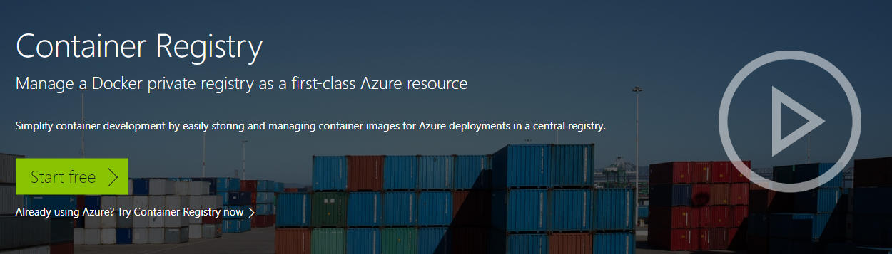

---

### Terminology

<b>Registry</b> 
Service that stores container images 
 
<b>Repository</b> 
Groups of container images – Same name, identified by tags 
	
---

### Features

<b>Encryption</b> 
All images encrypted at rest 
<b>Geo-redundant storage</b> 
Replication of images 
<b>Geo-replication</b> 
Guards against total regional failure 
<b>ACR Tasks</b> 
Container image build service 

---

### SKUs

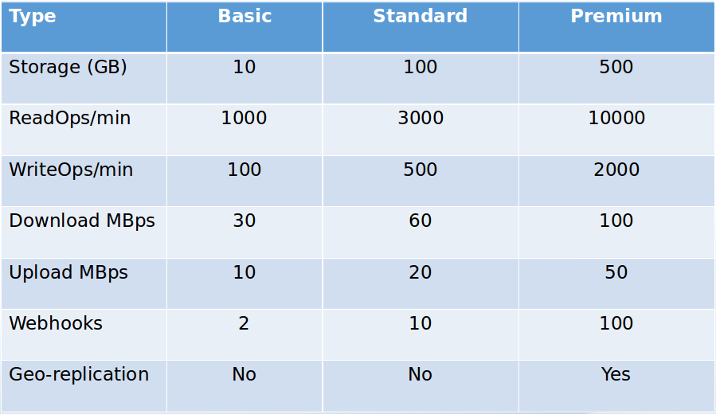

---?code=assets/code/acr_login.azcli&lang=bash&title=Login to Azure Account

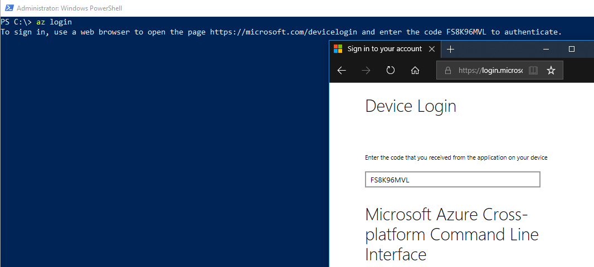

---?code=assets/code/acr_create_resource_group.azcli&lang=bash&title=Create Resource Group

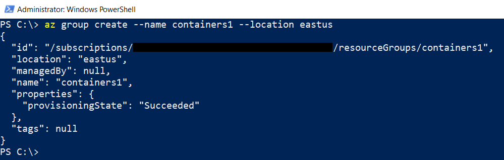

---?code=assets/code/acr_create_registry.azcli&lang=bash&title=Create Registry

---?code=assets/code/acr_login_registry.azcli&lang=bash&title=Log into Registry

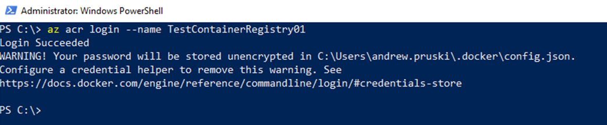

---?code=assets/code/acr_get_registry_details.azcli&lang=bash&title=Get Registry Details

---?code=assets/code/acr_tag_image.azcli&lang=bash&title=Tag Image

---?code=assets/code/acr_push_image.azcli&lang=bash&title=Push Image

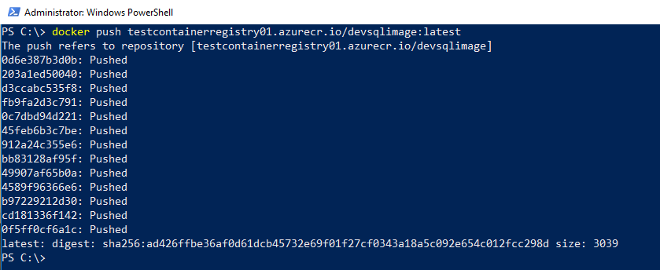

---?code=assets/code/acr_list_repos.azcli&lang=bash&title=List Repositories

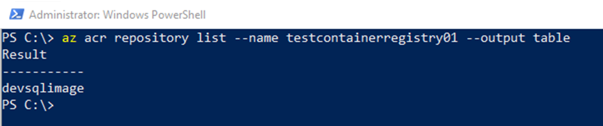

---?code=assets/code/acr_show_tags.azcli&lang=bash&title=Show Tags

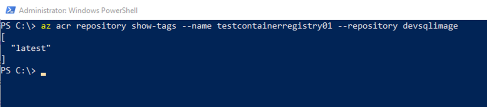

---

## Demo

---

## Azure Container Instances

---

### Azure Container Instances

@size[0.8em](https://azure.microsoft.com/en-us/services/container-instances/)

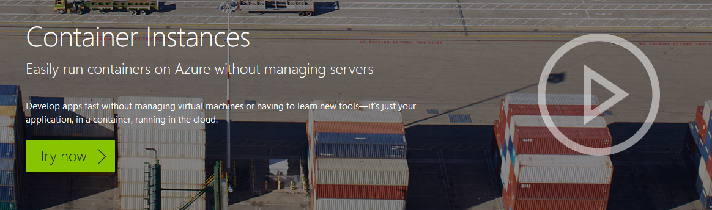

---

### Azure Container Instances

Running containers without servers  
No need to manage VMs  
Quick deployment  
Deployed via the CLI, powershell, or Azure Portal  
Billed by the second

---

### Options

Linux & Windows containers  
Containers exposed directly to the internet  
IP Address and FQDN  
Hypervisor level isolation <rb>
Persistent storage  
Azure files shares

---

### Container Groups

Similar in concept to K8s pods  
Multiple containers running on the same host  
Share IP address, containers exposed on ports  
Supports mounting external volumes

---?code=assets/code/aci_get_credentials.azcli&lang=bash&title=Get Credentials

@[1](Enable admin)
@[3](Show credentials)

---?code=assets/code/aci_create_keyvault.azcli&lang=bash&title=Create Keyvault

@[1-2](Create keyvault)
@[4-10](Create service principle and store password)
@[12-16](Store username)

---?code=assets/code/aci_create_container.azcli&lang=bash&title=Create Container

@[2](From custom image)
@[3](Specifying the resource group)
@[4-7](Retrieving the username stored in keyvault)
@[8-11](Retrieving the password stored in keyvault)
@[12](Setting the container name)
@[13](Specifying resources available to container)
@[14](Setting the required environment variables)
@[15](Specifying the IP address type)
@[16](Specifying the port to connect to)

---?code=assets/code/aci_get_container_status.azcli&lang=bash&title=Get Container Status

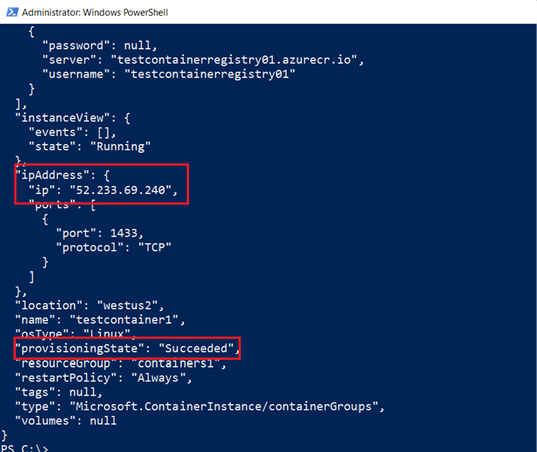

---

### Connect to Azure Container Instance

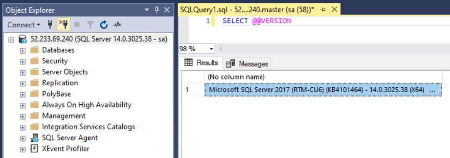

---

## Demo

---

## Azure Container Services

---

### Azure Container Services

@size[0.8em](https://azure.microsoft.com/en-us/services/container-service/)

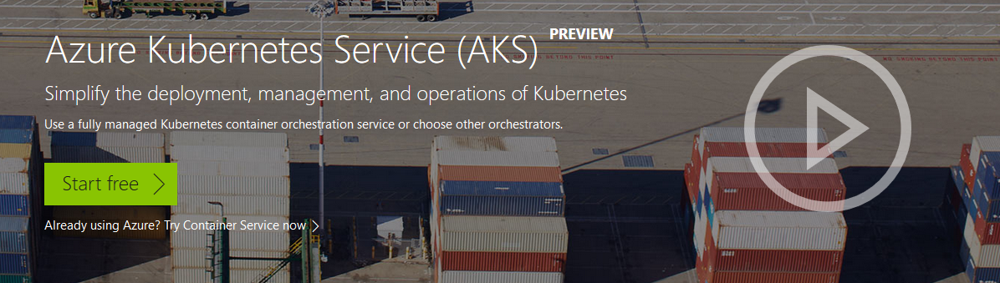

---

### Azure Container Services

 <b>Two flavours</b>  
Azure Container Services (ACS)  
Azure Container Services (AKS)  
 
ACS allows multiple orchestrators  
AKS is specifically built to implement Kubernetes

---

### Kubernetes

 
@size[0.9em](Open source)  
@size[0.9em](Deployed as a cluster)  
@size[0.9em](Pods hold containers on nodes)  
@size[0.9em](Services provide external access)  
@size[0.9em](Kubectl used to manage cluster)  

---

### Azure Container Services (AKS)

Simplifies deployment of Kubernetes clusters  
Cluster can be spun up with one line of code  
Applications deployed to cluster via yaml files  
Managed by Azure-CLI/powershell and kubectl  

---?code=assets/code/aks_create_cluster.azcli&lang=bash&title=Create Cluster

@[2](Specify the resource group)
@[3](Give the cluster a name)
@[4](Specify the number of nodes)
@[5](Generate keys so that we can connect)

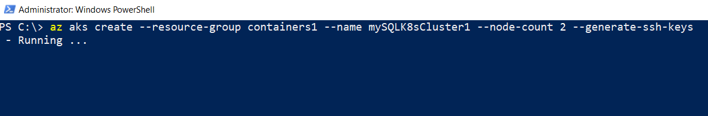

---?code=assets/code/aks_install_kubectl.azcli&lang=bash&title=Install Kubectl

---?code=assets/code/aks_get_cluster_credentials.azcli&lang=bash&title=Get Cluster Credentials

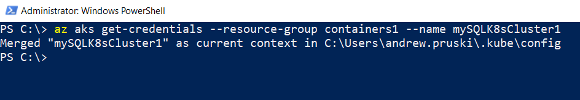

---?code=assets/code/aks_view_cluster_nodes.azcli&lang=bash&title=View Cluster Nodes

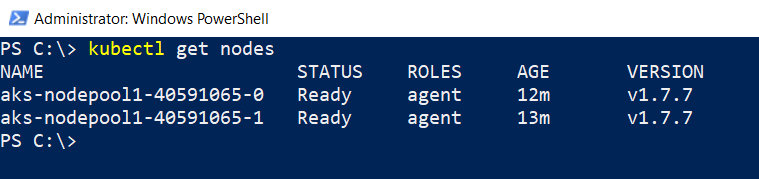

---?code=assets/code/aks_create_role.azcli&lang=bash&title=Create Role

@[1-5](Get cluster ID)
@[7-11](Get Azure Container Registry ID)
@[13-16](Create role to allow access to ACR)

---?code=assets/code/aks_yaml_file.yaml&lang=yaml&title=AKS yaml file

@[3-6](Metadata of deployment)
@[8](Number of replicas)
@[13-23](Pod declaration)
@[15](Pod name)
@[16](Image to be used)
@[17-18](Port on pod)
@[19-23](Setting environment variables)
@[24-35](Service)
@[26-27](Metadata)
@[29-32](Port on service to port on pod)
@[33-35](Selector)
@[35](External IP address)

---?code=assets/code/aks_deploy_to_cluster.azcli&lang=bash&title=Deploy to Cluster

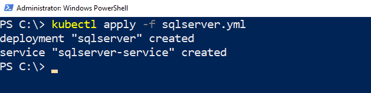

---?code=assets/code/aks_deployment_info.azcli&lang=bash&title=View Deployment

@[1](View deployments)
@[2](View nodes)
@[3](View services)

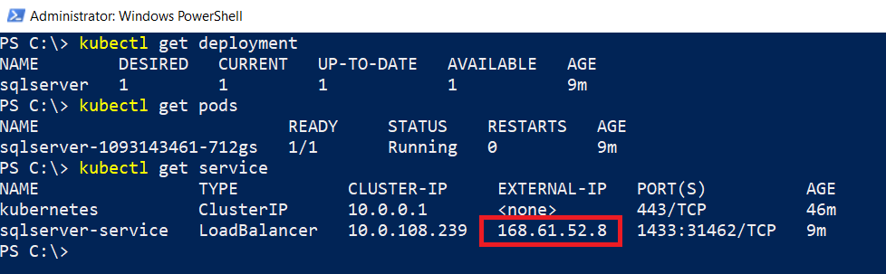

---

### Connect to SQL Server

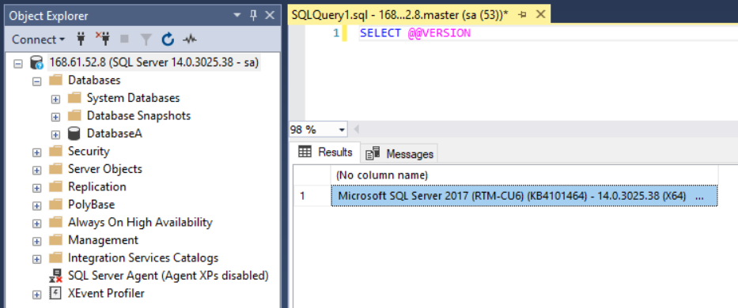

---

### Kubernetes Dashboard

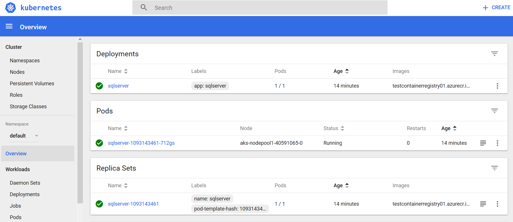

---

## Demo

---

## Case Study

---

### Problem

QA/Dev departments repeatedly creating new VMs  
All VMs require a local instance of SQL Server  
SQL installed from chocolately  
30+ databases then restored via PoSH scripts  
SQL install taking ~40 minutes from start to finish

---

### Solution

Containers!  
Implement containers running SQL Server  
SQL containers built from custom image  
No longer need to install SQL  
No longer need to restore databases  
Resources freed up on VMs 

---

### Windocks

A port of the open source project from Docker Inc.  
Software supports the creation of containers running earlier versions of SQL Server (2008+) on Windows Server 2008+  
Free Community Edition available 

---

### Architecture

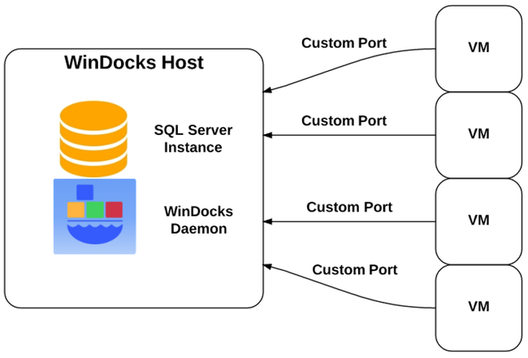

---

### Benefits

New VMs deployed in a fraction of the previous time  
No longer need to run PoSH scripts to restore databases  
Base image can be used to keep containers at production level  
More VMs can be provisioned on host due to each VM requiring less resources 

---

### Issues

 
Apps using DNS entries to reference local SQL instance  
Update to existing test applications  
Trial and error to integrate with Octopus deploy  
New ways of thinking 

---

### Resources

https://github.com/dbafromthecold/SqlServerAndContainersExtended  
 
https://dbafromthecold.com/2017/03/15/summary-of-my-container-series/ 

@snap[east]

@snapend
