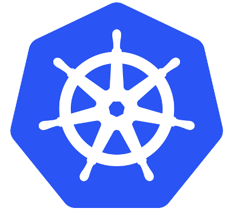
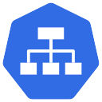

# SQL Server and Containers

---

## Andrew Pruski

### SQL Server DBA & Microsoft Data Platform MVP

@fa[twitter] @dbafromthecold  
@fa[envelope] dbafromthecold@gmail.com  
@fa[wordpress] www.dbafromthecold.com  
@fa[github] github.com/dbafromthecold

---

### Session Aim

To give an overview of the different options available to run SQL Server in containers

---

### Agenda

<b>Part One</b> - Introduction to docker (demos)  
<b>Part Two</b> - Overview of Kubernetes

---

### Container Definition

Containers wrap a piece of software in a complete filesystem that contains everything needed to run: code, runtime, system tools, system libraries – anything that can be installed on a server. This guarantees that the software will always run the same, regardless of its environment.  

@size[0.8em](https://www.docker.com/what-docker)

---

### Virtual Machines vs Containers

---

## Demos

---

## Case Study

---

### Problem

QA/Dev departments repeatedly creating new VMs  
All VMs require a local instance of SQL Server  
SQL installed from chocolately  
30+ databases then restored via PoSH scripts  
SQL install taking ~40 minutes from start to finish

---

### Solution

Containers!  
Implement containers running SQL Server  
SQL containers built from custom image  
No longer need to install SQL  
No longer need to restore databases  
Resources freed up on VMs 

---

### Windocks

A port of the open source project from Docker Inc.  
Software supports the creation of containers running earlier versions of SQL Server (2008+) on Windows Server 2008+  
Free Community Edition available 

---

### Architecture

---

### Benefits

New VMs deployed in a fraction of the previous time  
No longer need to run PoSH scripts to restore databases  
Base image can be used to keep containers at production level  
More VMs can be provisioned on host due to each VM requiring less resources 

---

### Issues

 
Apps using DNS entries to reference local SQL instance  
Update to existing test applications  
Trial and error to integrate with Octopus deploy  
New ways of thinking 

---

# Kubernetes

---

## What is Kubernetes?

@quote[Kubernetes is a portable, extensible open-source platform for managing containerized workloads and services, that facilitates both declarative configuration and automation. It has a large, rapidly growing ecosystem. Kubernetes services, support, and tools are widely available](kubernetes.io)

---

## Kubernetes

 
@size[0.9em](Open source orchestration engine)  
@size[0.9em](Designed by Google)  
@size[0.9em](Hosted by the Cloud Native Computing Foundation)  
@size[0.9em](Kubernetes v1.0 was released on July 21, 2015)

---

## Master

Components for controlling the cluster 

@ul
- @size[0.9em](kube-apiserver) 
- @size[0.9em](etcd) 
- @size[0.9em](kube-scheduler) 
- @size[0.9em](kube-controller-manager) 
- @size[0.9em](cloud-controller-manager) 
@ulend

---

## Nodes

Running and maintaining pods 

@ul
- @size[0.9em](kubelet) 
- @size[0.9em](kube-proxy) 
- @size[0.9em](Docker)
@ulend

---

## Pods

Smallest deployable units of computing 
Group of one or more containers 
Shared storage/network 
Holds specifications of containers

---

## Services

An abstraction over a set of pods 
Provides a stable networking endpoint 
Different types: - 

@ul
- @size[0.9em](ClusterIP) 
- @size[0.9em](NodePort) 
- @size[0.9em](LoadBalancer) 
- @size[0.9em](External Name)
@ul

---?code=assets/code/deployment_yaml_file.yaml&lang=yaml&title=Example yaml file

@[3-4](Metadata of deployment)
@[6](Number of replicas)
@[11-21](Pod declaration)
@[13](Pod name)
@[14](Image to be used)
@[15-16](Port)
@[17-21](Setting environment variables)
@[22-35](Service)
@[24-25](Metadata)
@[27-30](Port on service to port on pod)
@[31-33](External IP address)

---

# Demo

---

### Resources

https://github.com/dbafromthecold/SqlServerAndContainersExtended  
 
https://dbafromthecold.com/2017/03/15/summary-of-my-container-series/ 

@snap[east]

@snapend
